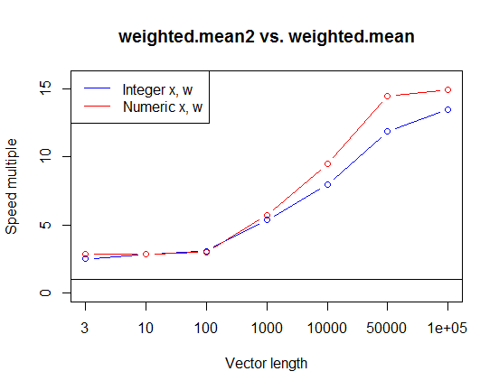
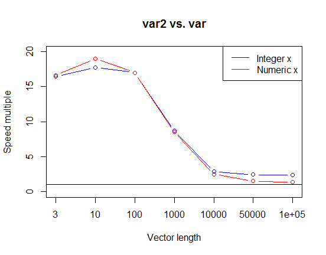

<!-- README.md is generated from README.Rmd. Please edit that file -->


## Concept

The concept for this package is crowdsourced optimization for speed. Long term, the goal is to optimize enough base R functions that a typical R user can drastically speed up their scripts by simply loading **crowdopt** and replacing functions like *mean* and *sd* with *mean2* and *sd2*.

Anyone can contribute on [GitHub](https://github.com/vandomed/crowdopt). Once you contribute a function, you become a co-author for the package, and remain a co-author even if your function eventually gets replaced by a faster one developed by somebody else.

To contribute a function, all you need to do is add a .R file with the code and documentation for your function, using *roxygen2* syntax. You can use `mean2.R` as a template. Be sure to include an *Examples* section in which you demonstrate that your function is faster than the corresponding base R function.

In general, contributed functions should be substantially faster than the corresponding base R function, ideally for both small and large objects (e.g. vectors of length 5 and 500,000).


## List of functions

| Function   | Faster version of: | C++?
|:-----------|:-------------------|---------------------------
| *mean2*    | *mean*             | Yes (for integer vectors)
| *sd2*      | *sd*               | Yes
| *var2*     | *var*              | Yes
| *cov2*     | *cov*              | Yes


## Proof of outperformance

### mean2

This is a faster version of the base R function *mean*, defined simply as `sum(x) / length(x)`. Speed advantage diminishes with `length(x)`.


```r
lengths <- c(3, 10, 100, 1000, 10000, 50000, 100000)
multiples1 <- multiples2 <- c()
for (ii in 1: 7) {
  print(ii)
  x1 <- rpois(lengths[ii], lambda = 3)
  x2 <- rnorm(lengths[ii])
  medians <- summary(microbenchmark(mean(x1), mean2(x1), mean(x2), mean2(x2), 
                                    times = 250))$median
  multiples1[ii] <- medians[1] / medians[2]
  multiples2[ii] <- medians[3] / medians[4]
}
#> [1] 1
#> [1] 2
#> [1] 3
#> [1] 4
#> [1] 5
#> [1] 6
#> [1] 7
plot(1: 7, multiples1, type = "b", col = "blue", main = "mean2 vs. mean", 
     ylab = "Speed multiple", xlab = "Vector length", xaxt = "n", 
     ylim = c(0, max(c(multiples1, multiples2)) * 1.05))
points(1: 7, multiples2, type = "b", col = "red")
axis(side = 1, at = 1: 7, labels = lengths)
abline(h = 1)
legend("topright", legend = c("Integer x", "Numeric x"), lty = 1, 
       col = c("blue", "red"))
```



### sd2

This is a faster version of base R function *sd*. For optimal speed, use `integer = TRUE` if `x` is an integer vector and `integer = FALSE` otherwise. Note that for long vectors the function *Var* in **Rfast** is typically much faster than *sd2*.


```r
for (ii in 1: 7) {
  x1 <- rpois(lengths[ii], lambda = 3)
  x2 <- rnorm(lengths[ii])
  medians <- summary(microbenchmark(sd(x1), sd2(x1, TRUE), sd(x2), sd2(x2), 
                                    times = 250))$median
  multiples1[ii] <- medians[1] / medians[2]
  multiples2[ii] <- medians[3] / medians[4]
}
plot(1: 7, multiples1, type = "b", col = "blue", main = "sd2 vs. sd", 
     ylab = "Speed multiple", xlab = "Vector length", xaxt = "n", 
     ylim = c(0, max(c(multiples1, multiples2)) * 1.05))
points(1: 7, multiples2, type = "b", col = "red")
axis(side = 1, at = 1: 7, labels = lengths)
abline(h = 1)
legend("topright", legend = c("Integer x", "Numeric x"), lty = 1, 
       col = c("blue", "red"))
```


### var2

This is a faster version of base R function *var*. For optimal speed, use `integer = TRUE` if `x` is an integer vector and `integer = FALSE` otherwise. Note that for long vectors the function *Var* in **Rfast** is typically much faster than *sd2*.


```r
for (ii in 1: 7) {
  x1 <- rpois(lengths[ii], lambda = 3)
  x2 <- rnorm(lengths[ii])
  medians <- summary(microbenchmark(var(x1), var2(x1, TRUE), var(x2), var2(x2), 
                                    times = 250))$median
  multiples1[ii] <- medians[1] / medians[2]
  multiples2[ii] <- medians[3] / medians[4]
}
plot(1: 7, multiples1, type = "b", col = "blue", main = "var2 vs. var", 
     ylab = "Speed multiple", xlab = "Vector length", xaxt = "n", 
     ylim = c(0, max(c(multiples1, multiples2)) * 1.05))
points(1: 7, multiples2, type = "b", col = "red")
axis(side = 1, at = 1: 7, labels = lengths)
abline(h = 1)
legend("topright", legend = c("Integer x", "Numeric x"), lty = 1, 
       col = c("blue", "red"))
```




### cov2

This is a faster version of base R function *cov*. For optimal speed, use `integer = TRUE` if `x` and `y` are integer vectors and `integer = FALSE` otherwise.


```r
for (ii in 1: 7) {
  x1 <- rpois(lengths[ii], lambda = 3)
  y1 <- rpois(lengths[ii], lambda = 3)
  x2 <- rnorm(lengths[ii])
  y2 <- rnorm(lengths[ii])
  medians <- 
    summary(microbenchmark(cov(x1, y1), cov2(x1, y1, TRUE), 
                           cov(x2, y2), cov2(x2, y2), times = 250))$median
  multiples1[ii] <- medians[1] / medians[2]
  multiples2[ii] <- medians[3] / medians[4]
}
plot(1: 7, multiples1, type = "b", col = "blue", main = "cov2 vs. cov", 
     ylab = "Speed multiple", xlab = "Vector length", xaxt = "n", 
     ylim = c(0, max(c(multiples1, multiples2)) * 1.05))
points(1: 7, multiples2, type = "b", col = "red")
axis(side = 1, at = 1: 7, labels = lengths)
abline(h = 1)
legend("topright", legend = c("Integer x", "Numeric x"), lty = 1, 
       col = c("blue", "red"))
```


## References
