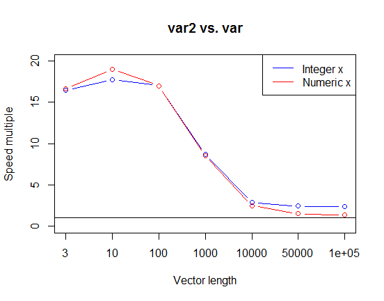
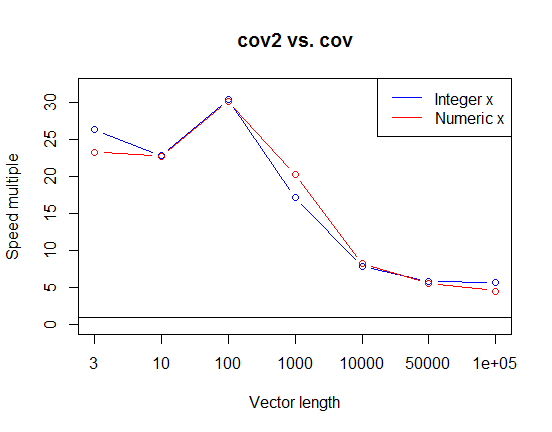
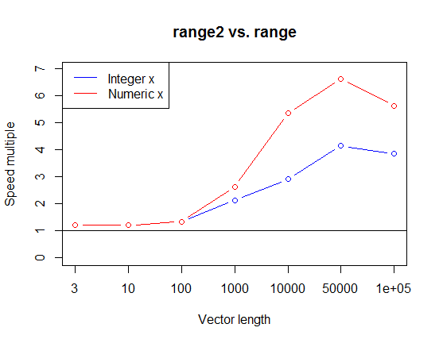

Crowd-Optimized R Functions
================
Dane Van Domelen <br> <vandomed@gmail.com>
2018-03-17

<!-- README.md is generated from README.Rmd. Please edit that file -->
Concept
-------

The concept for this package is crowdsourced optimization for speed. Long term, the goal is to optimize enough base R functions that a typical R user can drastically speed up their scripts by simply loading **crowdopt** and replacing functions like *mean* and *sd* with *mean2* and *sd2*.

Anyone can contribute on [GitHub](https://github.com/vandomed/crowdopt). Once you contribute a function, you become a co-author for the package, and remain a co-author even if your function eventually gets replaced by a faster one developed by somebody else.

To contribute a function, all you need to do is add a .R file with the code and documentation for your function, using *roxygen2* syntax. You can use `mean2.R` as a template. Be sure to include an *Examples* section in which you demonstrate that your function is faster than the corresponding base R function.

In general, contributed functions should be substantially faster than the corresponding base R function, ideally for both small and large objects (e.g. vectors of length 5 and 500,000).

List of functions
-----------------

| Function | Faster version of: | C++?                      |
|:---------|:-------------------|---------------------------|
| *mean2*  | *mean*             | Yes (for integer vectors) |
| *sd2*    | *sd*               | Yes                       |
| *var2*   | *var*              | Yes                       |
| *cov2*   | *cov*              | Yes                       |

Proof of outperformance
-----------------------

### mean2

This is a faster version of the base R function *mean*, defined simply as `sum(x) / length(x)`. Speed advantage diminishes with `length(x)`.

``` r
lengths <- c(3, 10, 100, 1000, 10000, 50000, 100000)
times <- matrix(NA, ncol = 4, nrow = length(lengths))
for (ii in 1: length(lengths)) {
  x1 <- rpois(lengths[ii], lambda = 3)
  x2 <- rnorm(lengths[ii])
  times[ii, ] <- summary(microbenchmark(mean(x1), mean2(x1), 
                                        mean(x2), mean2(x2), 
                                        times = 1000, unit = "us"))$median
}
multiples1 <- times[, 1] / times[, 2]
multiples2 <- times[, 3] / times[, 4]
plot(1: length(lengths), multiples1, type = "b", col = "blue", 
     main = "mean2 vs. mean", ylab = "Speed multiple", xlab = "Vector length", 
     xaxt = "n", ylim = c(0, max(c(multiples1, multiples2)) * 1.05))
points(1: length(lengths), multiples2, type = "b", col = "red")
axis(side = 1, at = 1: length(lengths), labels = lengths)
abline(h = 1)
legend("topright", legend = c("Integer x", "Numeric x"), lty = 1, 
       col = c("blue", "red"))
```


### sd2

This is a faster version of base R function *sd*. For optimal speed, use `integer = TRUE` if `x` is an integer vector and `integer = FALSE` otherwise. Note that for long vectors the function *Var* in **Rfast** is typically much faster than *sd2*.

``` r
times <- matrix(NA, ncol = 4, nrow = length(lengths))
for (ii in 1: length(lengths)) {
  x1 <- rpois(lengths[ii], lambda = 3)
  x2 <- rnorm(lengths[ii])
  times[ii, ] <- summary(microbenchmark(sd(x1), sd2(x1, TRUE),
                                        sd(x2), sd2(x2), 
                                        times = 1000, unit = "us"))$median
}
multiples1 <- times[, 1] / times[, 2]
multiples2 <- times[, 3] / times[, 4]
plot(1: length(lengths), multiples1, type = "b", col = "blue", 
     main = "sd2 vs. sd", ylab = "Speed multiple", xlab = "Vector length", 
     xaxt = "n", ylim = c(0, max(c(multiples1, multiples2)) * 1.05))
points(1: length(lengths), multiples2, type = "b", col = "red")
axis(side = 1, at = 1: length(lengths), labels = lengths)
abline(h = 1)
legend("topright", legend = c("Integer x", "Numeric x"), lty = 1, 
       col = c("blue", "red"))
```



### var2

This is a faster version of base R function *var*. For optimal speed, use `integer = TRUE` if `x` is an integer vector and `integer = FALSE` otherwise. Note that for long vectors the function *Var* in **Rfast** is typically much faster than *sd2*.

``` r
times <- matrix(NA, ncol = 4, nrow = length(lengths))
for (ii in 1: length(lengths)) {
  x1 <- rpois(lengths[ii], lambda = 3)
  x2 <- rnorm(lengths[ii])
  times[ii, ] <- summary(microbenchmark(var(x1), var2(x1, TRUE),
                                        var(x2), var2(x2), 
                                        times = 1000, unit = "us"))$median
}
multiples1 <- times[, 1] / times[, 2]
multiples2 <- times[, 3] / times[, 4]
plot(1: length(lengths), multiples1, type = "b", col = "blue", 
     main = "var2 vs. var", ylab = "Speed multiple", xlab = "Vector length", 
     xaxt = "n", ylim = c(0, max(c(multiples1, multiples2)) * 1.05))
points(1: length(lengths), multiples2, type = "b", col = "red")
axis(side = 1, at = 1: length(lengths), labels = lengths)
abline(h = 1)
legend("topright", legend = c("Integer x", "Numeric x"), lty = 1, 
       col = c("blue", "red"))
```



### cov2

This is a faster version of base R function *cov*. For optimal speed, use `integer = TRUE` if `x` and `y` are integer vectors and `integer = FALSE` otherwise.

``` r
times <- matrix(NA, ncol = 4, nrow = length(lengths))
for (ii in 1: length(lengths)) {
  x1 <- rpois(lengths[ii], lambda = 3)
  y1 <- rpois(lengths[ii], lambda = 3)
  x2 <- rnorm(lengths[ii])
  y2 <- rnorm(lengths[ii])
  times[ii, ] <- summary(microbenchmark(cov(x1, y1), cov2(x1, y1, TRUE), 
                                        cov(x2, y2), cov2(x2, y2),
                                        times = 1000, unit = "us"))$median
}
multiples1 <- times[, 1] / times[, 2]
multiples2 <- times[, 3] / times[, 4]
plot(1: length(lengths), multiples1, type = "b", col = "blue", 
     main = "cov2 vs. cov", ylab = "Speed multiple", xlab = "Vector length", 
     xaxt = "n", ylim = c(0, max(c(multiples1, multiples2)) * 1.05))
points(1: length(lengths), multiples2, type = "b", col = "red")
axis(side = 1, at = 1: length(lengths), labels = lengths)
abline(h = 1)
legend("topright", legend = c("Integer x", "Numeric x"), lty = 1, 
       col = c("blue", "red"))
```



References
----------

Eddelbuettel, Dirk. 2013. *Seamless R and C++ Integration with Rcpp*. New York: Springer. doi:[10.1007/978-1-4614-6868-4](https://doi.org/10.1007/978-1-4614-6868-4).

Eddelbuettel, Dirk, and James Joseph Balamuta. 2017. “Extending extitR with extitC++: A Brief Introduction to extitRcpp.” *PeerJ Preprints* 5 (August): e3188v1. doi:[10.7287/peerj.preprints.3188v1](https://doi.org/10.7287/peerj.preprints.3188v1).

Eddelbuettel, Dirk, and Romain François. 2011. “Rcpp: Seamless R and C++ Integration.” *Journal of Statistical Software* 40 (8): 1–18. doi:[10.18637/jss.v040.i08](https://doi.org/10.18637/jss.v040.i08).

Papadakis, Manos, Michail Tsagris, Marios Dimitriadis, Stefanos Fafalios, Ioannis Tsamardinos, Matteo Fasiolo, Giorgos Borboudakis, John Burkardt, Changliang Zou, and Kleanthi Lakiotaki. 2018. *Rfast: A Collection of Efficient and Extremely Fast R Functions*. <https://CRAN.R-project.org/package=Rfast>.
